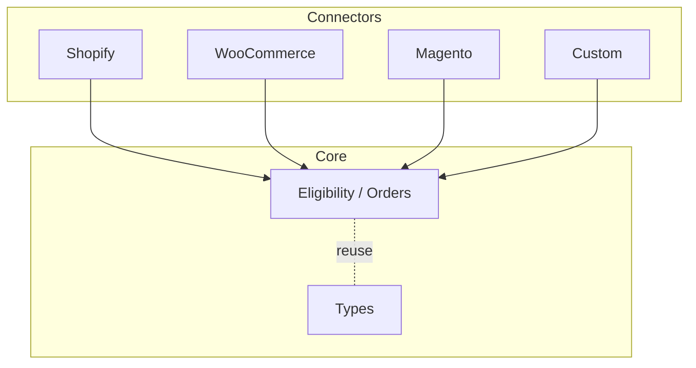

# Architecture Overview

This document complements the README with a visual of the request and webhook flows and how platform connectors fit around the shared JENNi core.

## Eligibility Request Flow

```mermaid
flowchart TD
  A[Browser Widget / Demo] -->|GET /apps/jenni/v1/eligibility?gtin&zip| B[Shopify App Proxy]
  B --> C[Express /v1 (src/routes/jenni.ts)]
  C --> D[Eligibility Core (src/core/eligibility.ts)]
  D -->|getAccessToken| E[(Redis Cache)]
  D --> F[JENNi Auth /auth/token]
  D --> G[JENNi API /searchProducts]
  F --> D
  E -. cache {eligible} .-> C
  G --> D
  C -->|JSON { eligible }| A
```

- Cache: eligibility result cached for 10 minutes (Redis).
- Page size: `page_size = 10` for JENNi queries.

## Order + Webhook Flow

```mermaid
flowchart LR
  W[Shopify Webhooks] -->|orders/create, products/*, GDPR| X[Express /webhooks]
  X --> Y[Shopify Connector (src/connectors/shopify.ts)]
  Y -->|map to JenniOrder| Q[(BullMQ Queue)]
  Q --> R[Worker (src/queue.ts)]
  R --> S[JENNi Orders API]
  Y --> T[Shopify GraphQL]
  T --> U[Shopify Fulfillment]
```

- Orders are enqueued to avoid webhook timeouts; worker submits to JENNi.
- Status updates use Shopify GraphQL (fulfillment) when applicable.

## Platform Connectors



- Contract: `src/connectors/interface.ts` (`Connector` interface).
- Add new platforms in `src/connectors/<platform>.ts` and keep JENNi API calls in `src/core/*`.

## Key Files
- App entry: `src/index.ts`
- Eligibility: `src/core/eligibility.ts`
- Shopify connector: `src/connectors/shopify.ts`
- Routes: `src/routes/jenni.ts`, `src/routes/webhook.ts`, `src/routes/gdpr.ts`
- Queue: `src/queue.ts`
