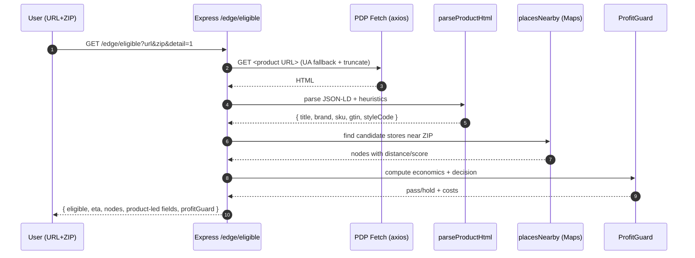

# Architecture Overview

This guide gives a skimmable map of the app: runtime surfaces (APIs and demo UIs), key modules, request flows, ProfitGuard math, configuration, and how to run it locally for demos.

## High-level map

```mermaid
flowchart LR
  subgraph Node/Express (src/index.ts)
    H[/_health]
    V[/v1/* routes\nsrc/routes/jenni.ts]
    AP[/apps/jenni/v1/*\n(Shopify App Proxy)]
    W[/webhooks/*\nsrc/routes/webhook.ts]
    G[/webhooks/gdpr/*\nsrc/routes/gdpr.ts]
    E[/edge/* demo API\nsrc/routes/edge.ts]
    SE[/edge static\npublic/edge]
    GO[/go static\npublic/go]
    TRY[/try static\npublic/try]
  end
  V --> C1[Core: eligibility\nsrc/core/eligibility.ts]
  E --> C1
  E --> C2[ProfitGuard\nsrc/core/profitGuard.ts]
  W --> K[Connectors\nsrc/connectors/shopify.ts]
  K --> Q[(Queue workers\nsrc/queue.ts)]

  C1 <---> J[JENNi API]
  K <---> S[Shopify API]
  E --> M[Google Maps API\n(places/geocode)]
```

Surfaces and purpose:
- Core API (/v1, /apps/jenni/v1 via App Proxy): server-side eligibility and app endpoints for Shopify.
- Webhooks (/webhooks, /webhooks/gdpr): order lifecycle and compliance.
- Edge demo API (/edge/*): zero-install product-led demo endpoints, loader/embed scripts, and hosted preview overlay.
- Static demo pages: `/edge/install` (installer), `/edge/play` (paste URL+ZIP), `/go` (magic link UI), `/try` (auto-route CTA).

## Endpoint catalog (most-used)

- GET `/_health` → { ok, time }
- GET `/v1/availability?gtin=&zip=&storeId=` → server-side eligibility proxy
- Edge demo API (`src/routes/edge.ts`):
  - GET `/edge/eligible?url=&zip=&detail=1&debug=1` → fetch PDP, fingerprint, run resolve+ProfitGuard; returns product-led fields (matchType, substitutionLevel, suggestedIncentive, waitlistOffered, nodes Pass/Hold)
  - POST `/edge/resolve` → like eligible but expects parsed fingerprint payload
  - GET `/edge/places?zip=&q=&brand=&sc=&probe=1` → nearby store candidates (Google Places when key present; demo fallback otherwise)
  - GET `/edge/geo/rev?lat=&lng=` → reverse geocode to ZIP (Google when key present; demo fallback otherwise)
  - GET `/edge/detect?url=` → detect platform (Shopify/GTM/unknown) for auto-routing
  - GET `/edge/client.js` → in-page widget client
  - GET `/edge/loader.js` → minimal loader that injects client.js; configure via data-jenni-* attributes
  - GET `/edge/embed.js` → single-tag embed with client bundled; good for GTM or quick tests
  - GET `/edge/snippet` → returns ready-made loader/embed HTML strings
  - GET `/edge/install`, `/edge/play` → static helper pages
  - GET `/edge/preview-overlay?url=&zip=` → hosted preview UI with badges and per-store economics

## Key modules

- `src/index.ts` – Express app wiring, mounts routes and static demo assets.
- `src/routes/edge.ts` – All demo endpoints, PDP fingerprinting, Google Places integration, resolve/economics, preview overlay HTML, client/loader/embed delivery.
- `src/core/profitGuard.ts` – ProfitGuard economics: fee, courier, landed cost, margin floor, pass/hold decision.
- `src/core/eligibility.ts` – Thin wrapper to call JENNi eligibility API (used by /v1 and /edge resolve when GTIN present).
- `src/connectors/` – Shopify connector and interface for other platforms.
- `examples/edge-demo/edge.js` – In-page widget: pill + panel, SPA-resilient and ZIP-aware.
- `public/edge/*` and `public/go/*` – Static demo pages.
- `tests/*` – Node scripts to exercise key flows end-to-end.

## ProfitGuard (economics) at a glance

Inputs (per request):
- price: PDP sale price (or local minPrice when available)
- distanceMiles: best candidate store distance
- trustScore: 0..1 store confidence score
- buyCost (optional): known procurement cost; else use cogsPct * price

Computed:
- courier_est = courierBase + courierPerMile * distanceMiles
- fee = feePct * price
- landed_cost = buyCost ?? cogsPct * price
- floor = max(floorAbs, floorPct * price)
- margin = price - landed_cost - fee - courier_est
- pass = margin >= floor AND trustScore >= trustThreshold

Knobs (from `appConfig.profitGuard` with env fallbacks):
- floorAbs, floorPct, feePct, cogsPct, courierBase, courierPerMile, trustThreshold, etaCutoffMin

Returned fields (typical): price, buy_cost, courier_est, fee, margin, floor, trustScore, pass, reason.

## Flow: Edge eligible (magic link)



## Directory map (selected)

- `src/` – App code
  - `index.ts` – server bootstrap
  - `routes/edge.ts` – demo API and UI helpers
  - `routes/jenni.ts`, `routes/webhook.ts`, `routes/gdpr.ts`
  - `core/eligibility.ts`, `core/profitGuard.ts`, `core/types.ts`
  - `connectors/` – platform adapters
- `examples/edge-demo/` – widget client (`edge.js`) and demo server
- `public/edge/` – install/play pages; `public/go/` – magic link UI; `public/try/` – auto-route CTA
- `tests/` – runnable Node tests for API/demo flows
- `scripts/` – demo servers and utilities

## Configuration

- ProfitGuard: via `appConfig.profitGuard` (and environment fallbacks used in demo-only paths):
  - `PROFIT_FLOOR_ABS`, `PROFIT_FLOOR_PCT`, `PROFIT_FEE_PCT`, `DEFAULT_COGS_PCT`, `COURIER_BASE`, `COURIER_PER_MILE`, `TRUST_THRESHOLD`, `ETA_CUTOFF_MIN`
- Google Maps (optional): `GOOGLE_MAPS_API_KEY` enables reverse geocoding and Places search. Without it, demo fallbacks are used.
- Timeouts: `PREVIEW_FETCH_TIMEOUT_MS`, `MAPS_HTTP_TIMEOUT_MS` bound upstream calls for responsive demos.

## Developer quickstart

1) Install, build, run

```bash
npm install
npm run build
npm start
```

2) Open health check and demos

- Health: http://localhost:4000/_health
- Magic link UI: http://localhost:4000/go/
- Paste URL demo: http://localhost:4000/edge/play
- Hosted overlay: http://localhost:4000/edge/preview-overlay?url=...&zip=10001
- Snippet: http://localhost:4000/edge/snippet

3) Dev mode (hot reload): `npm run dev`

## Notes and guardrails

- PDP fetches are HTML-only, bounded by size and time; dual UA attempts improve coverage.
- Basic SSRF guard blocks private hosts (localhost/10./192.168./0.0.0.0).
- When Maps API key is not present, realistic demo fallbacks are used for places and reverse geocoding.

